# Hand Command Recognizer on Google Vision AIY kit

## Objective 

This project demonstrates how, by creating a training set of only 1,500 images from scratch, carefully selecting a search region and applying Transfer Learning technique, one can build and deploy on Edge AI device - Google Vision API kit – the model which reliably recognizes simple hand gestures. A fairly accurate model with a latency of 1-2 seconds runs on the Google Vision box and does not require any access to Internet or Cloud. It can be used to control your mobile robot, replace your TV remote control or for many other applications. The described approach of carefully selecting the search region, collecting a relatively small number of customized training images and re-training open-sourced Deep Learning models to create a model for a specific task (e.g. the model which controls access to the facilities by recognizing faces of the company's employees) can be applied to create numerous and diverse applications.

## Demo

<a href="https://youtu.be/t6PqVN4q7Sw
" target="_blank"></a>

## Installation

1. Buy Google Vision AIY kit and assemble it following [these instructions](https://aiyprojects.withgoogle.com/vision)
2. Power the assembled Google Vision AIY kit
3. Start Dev terminal
4. Stop and disable joy_detector_demo application which is set to start automatically after the booting

 ```
 sudo systemctl stop joy_detection_demo.service
 sudo systemctl disable joy_detection_demo.service
 ```
5. Update OS

 ```
 sudo apt-get update
 sudo apt-get upgrade
 ```

6. Clone the github repository with hand gesture classifier and navigate to the project folder

 ```
 cd src/examples/vision 
 git clone https://github.com/dvillevald/hand_gesture_classifier.git
 cd hand_gesture_classifier
 chmod +x hand_gesture_classifier.py
 ```

7. Start hand gesture classifier

 ```
 ./hand_gesture_classifier.py  \
  --model_path ~/AIY-projects-python/src/examples/vision/hand_gesture_classifier/hand_gesture_classifier.binaryproto \
  --label_path ~/AIY-projects-python/src/examples/vision/hand_gesture_classifier/hand_gesture_labels.txt  \
  --input_height 160   \
  --input_width 160    \
  --input_layer input  \
  --output_layer final_result
 ```

  **Important:** It seems that on some Google Vision AIY kits the logic of GPIO pins is inversed - pin.off() changes pin status to HIGH and pin.on() - to LOW. If you observe that your hand command classifier works but shows incorrect commands (e.g. displays *right* instead of *left*) then add the following line to the command above:

  ```
   --gpio_logic INVERSE
 ```

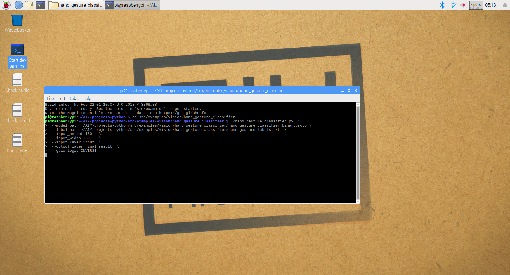

## How hand gesture classifier works

### Step 1. Face detection

LED on the Kit Top = 

Once you start the application, it launches *face/joy detector* pre-installed on the Google Vision AIY kit which tries to detect the human face and determine the size and location of the bounding box around it. During this step the LED on the top of the Google Vision box is **GREEN**. 

Once the face is reliably detected on several dozens of frames, application uses the size and the location of the face bounding box to determine the size and location of the the chest area (called hand box hereinafter) where the hand gestures are expected to be displayed:


There are several advantages of this approach:

 1. The search space is greatly reduced to only include the chest area which significantly improves the latency of the detector. 
  
 2. Displaying hand gestures in the chest area improves the quality of the hand detector as a user has a high degree of control of the image background (one's t-shirt) and because the number and diversity of possible backgrounds is greatly reduced (to the number of t-shorts and sweaters in user's wardrobe.) Because of that one does not need a large data set to build a model which makes a fairly accurate predictions so it takes less time to collect the training data and to train your model.

#### If face detection takes longer than 10-15 seconds:

 - It is possible that the face detector cannot detect your face if, for example, your wear a particular glasses. Before starting this application, make sure Google's face/joy detector can detect your face (e.g. reacts to your smile.)
 - Make sure you stand still during this step – to better estimate the parameters of the face bounding box the face detector compares face box parameters on several frames and will only proceed to the next step when they are stable. 
 - Move further away from the camera – it is possible that you are too close and while your face is detected, your chest area does not fit into the image. The optimal distance from the Google Vision kit is about 10 feet (3 meters.)  

Once you face is reliably detected the LED on the top of Google Vision box turns **PURPLE**, face detection stops and the hand gesture recognizer is loaded ready to be activated. 

### Step 2. Activating hand gesture recognizer

LED on the Kit Top = 

To make sure the application does not react to the noise, the hand command recognizer should be activated. To activate hand gesture recognizer, display one of these two hand commands in your chest area for 5-7 seconds.

#### Activate: 

 

Once LED of the top of Google Vision box turns **RED**, hand gesture recognizer is activated and is ready to accept your hand signals. If hand gesture recognizer fails to be activated after 30 seconds of waiting, the application goes to face detection mode again (Step 1 above.)

### Step 3. Sending hand commands to your devices

LED on the Kit Top = 

Once hand recognizer is activated (LED is **RED**), you can start displaying your hand commands to control your external devices. It takes 1-2 seconds to detect a hand signal, so in order to avoid sending the wrong command, try to move your hands fast from one signal to another or, better yet, put your hands down in between the signals so no hand signal is detected.

The following hand gestures are available:

#### Right:


#### Left:

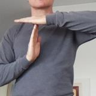

#### Forward:


#### Backward:


#### Stop:


#### No hand command:


Once your hand command is detected, it will be printed in terminal.

Also, it will change the state of GPIO pins on the back of Google Vision AIY kit which you can use to control your external devices. The following table shows the mapping of your hand commands above to the states of GPIO pins A, B and C of the Google Vision AIY kit.

#### Mapping Hand Commands to Google Vision AIY Kit GPIO pins:

| Hand Command                                  | Pin A | Pin B | Pin C |
| --------------------------------------------- | ----- | ----- | ----- |
| Deactivate / Activate hand gesture recognizer | HIGH  | HIGH  | LOW   | 
| Right                                         | LOW   | HIGH  | LOW   |
| Left                                          | LOW   | LOW   | HIGH  | 
| Forward                                       | LOW   | HIGH  | HIGH  |
| Backward                                      | HIGH  | LOW   | LOW   |
| Stop                                          | HIGH  | LOW   | HIGH  |
| No hand command                               | LOW   | LOW   | LOW   |

### Step 4. Deactivating hand command recognizer

To close your hand command session, make sure you deactivate the recognizer so it would stop sending commands to your devices. To deactivate the device, display one of the following 2 hand gestures for 5-7 seconds.

#### Deactivate:
 

Once deactivated, the LED on the top of Google Vision AIY kit will turn off and the application will go into the face detection mode (Step 1 above.) 

### Step 5. Shutting down Google Vision AIY kit

You can terminate the application and safely shut down your Google Vision AIY kit at any time by pushing the button on the top of the Google Vision AIY kit.

## (OPTIONAL) Hand Command Display Box

You can buid a simple device which, once connected to Google Vision AIY kit via GPIO pins, will display your hand commands. I built this display box 

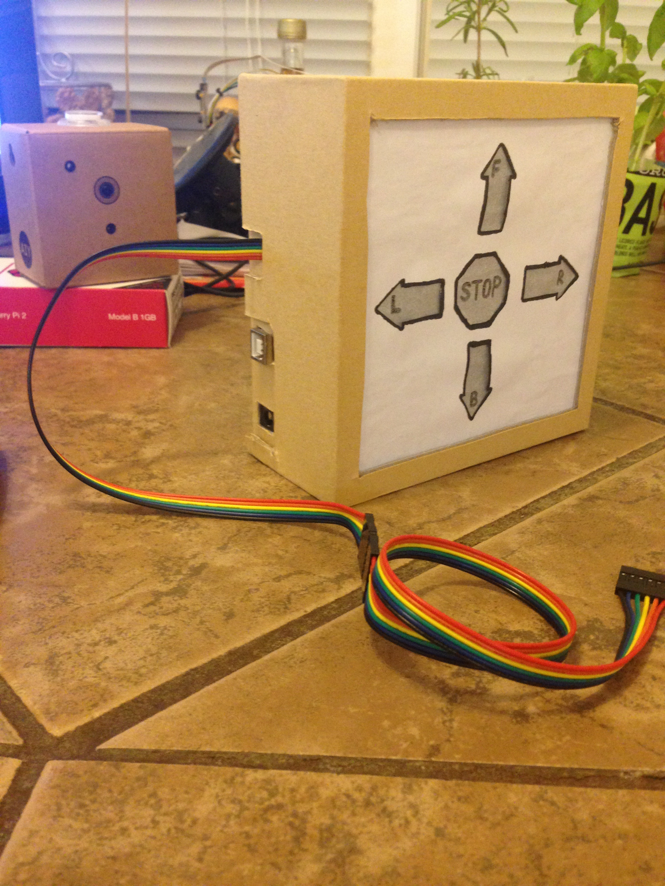

from the following components:

 - [Arduino UNO](https://www.sparkfun.com/products/11021)
 - [Logic Level Converter](https://www.sparkfun.com/products/12009)
 - [Jumper Wire - 0.1", 6-pin, 12"](https://www.sparkfun.com/products/10376)
 - 5 x resistors 330 Ohm
 - 5 x red LEDs
 - 2 x [PCB Boards](https://www.amazon.com/dp/B075VSJCD2)
 - Wires
 - Power supply for Arduino
 - Cardboard box (from belt or shoes)
 
Arduino UNO is 5V device. However, GPIO pins of Google Vision AIY kit output 3.3V-based signals. Because of that you would need 3.3V-to-5V Logic Level Converter to step up signals from Raspberry Pi of Google Vision AIY kit. 
 
### Schematic diagram  

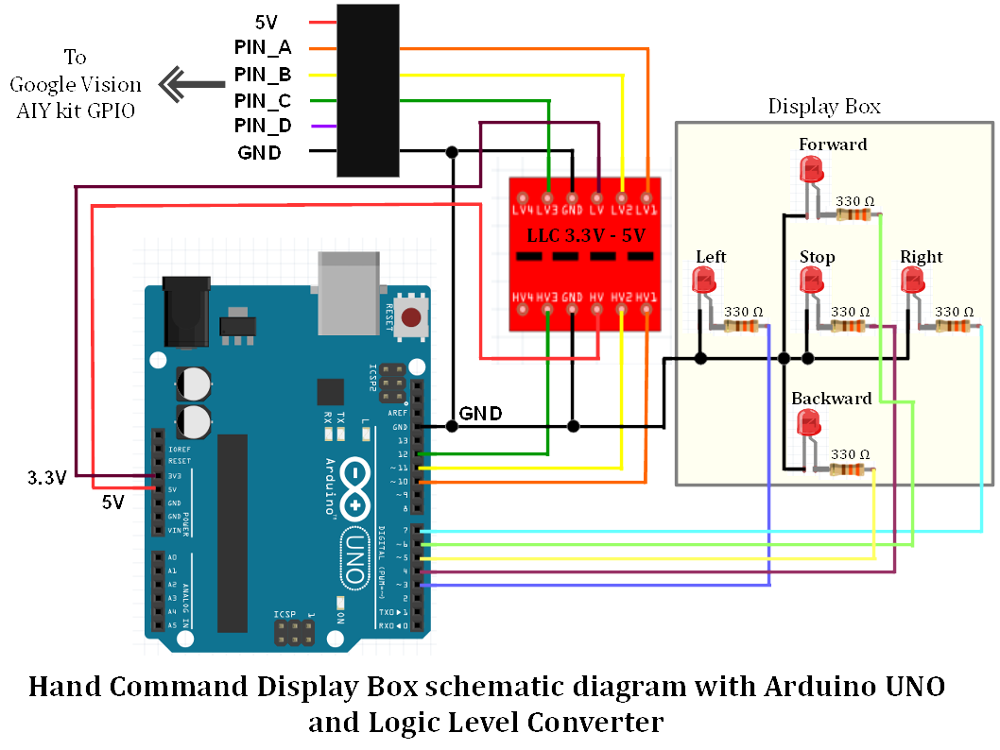

### Assembling the Display Box 

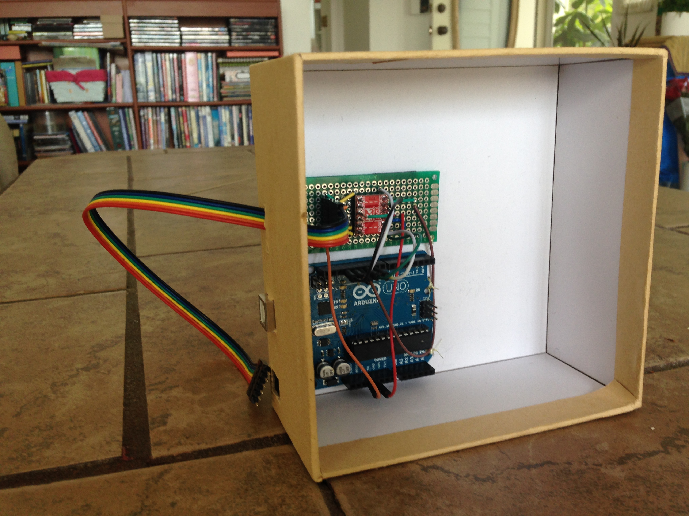 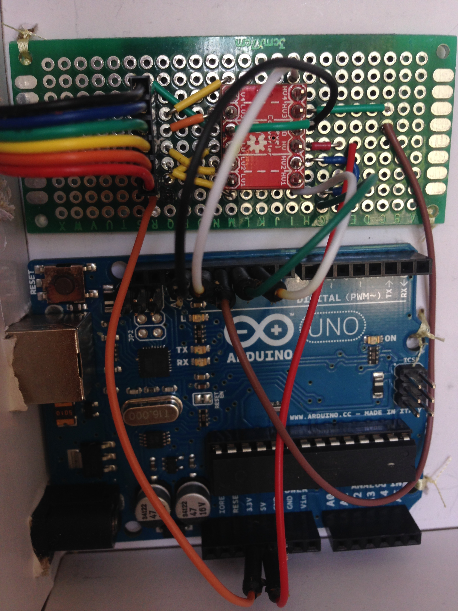
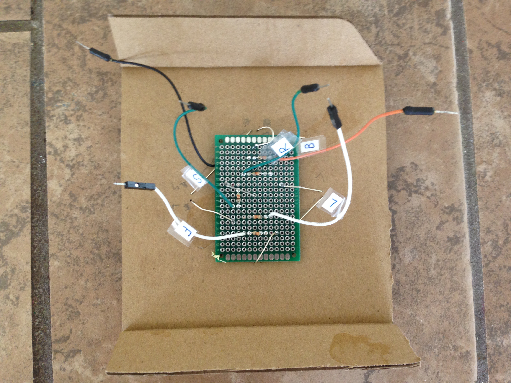 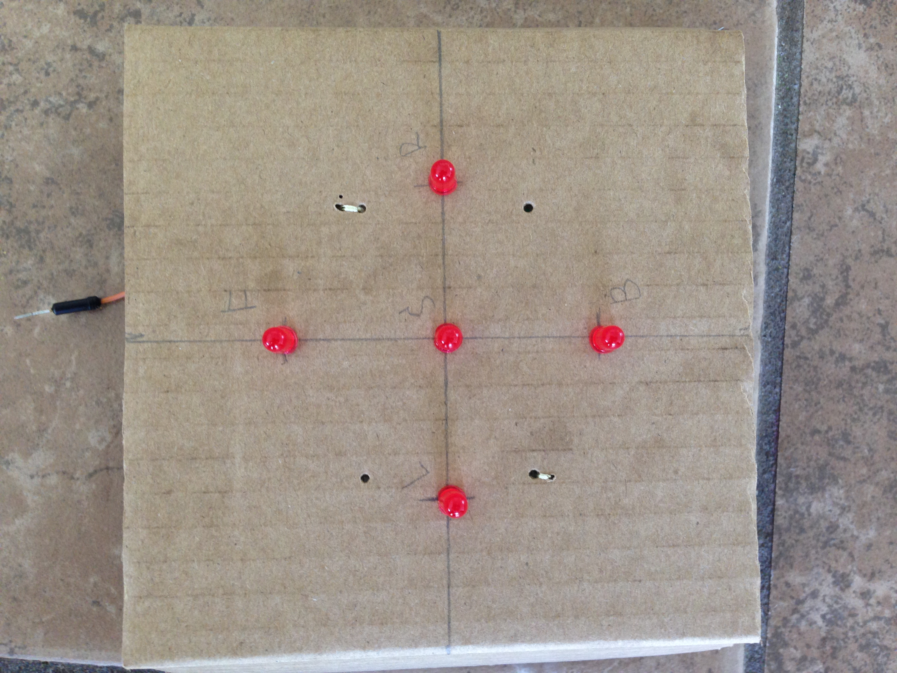
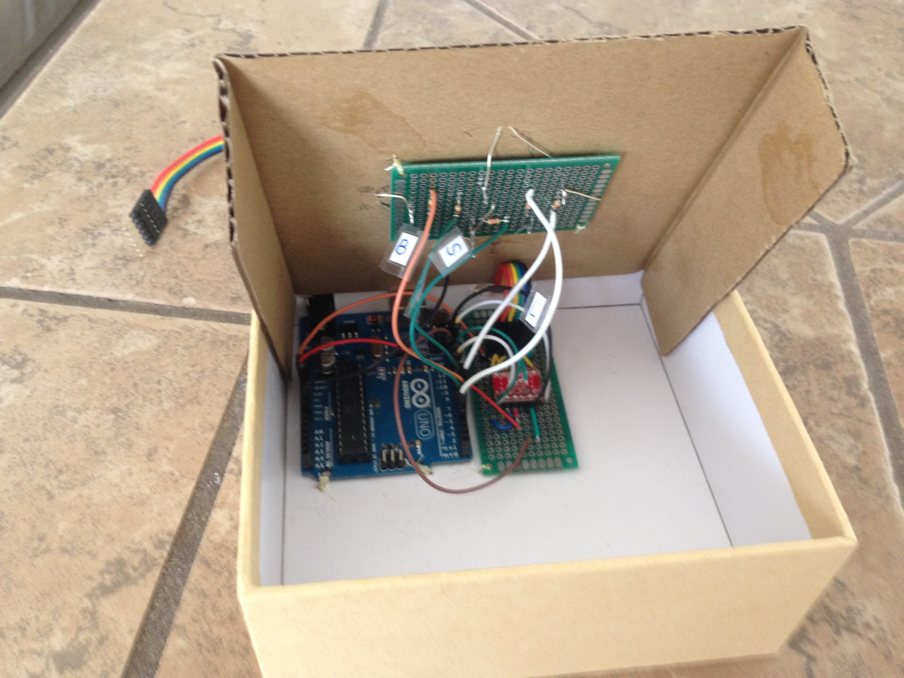 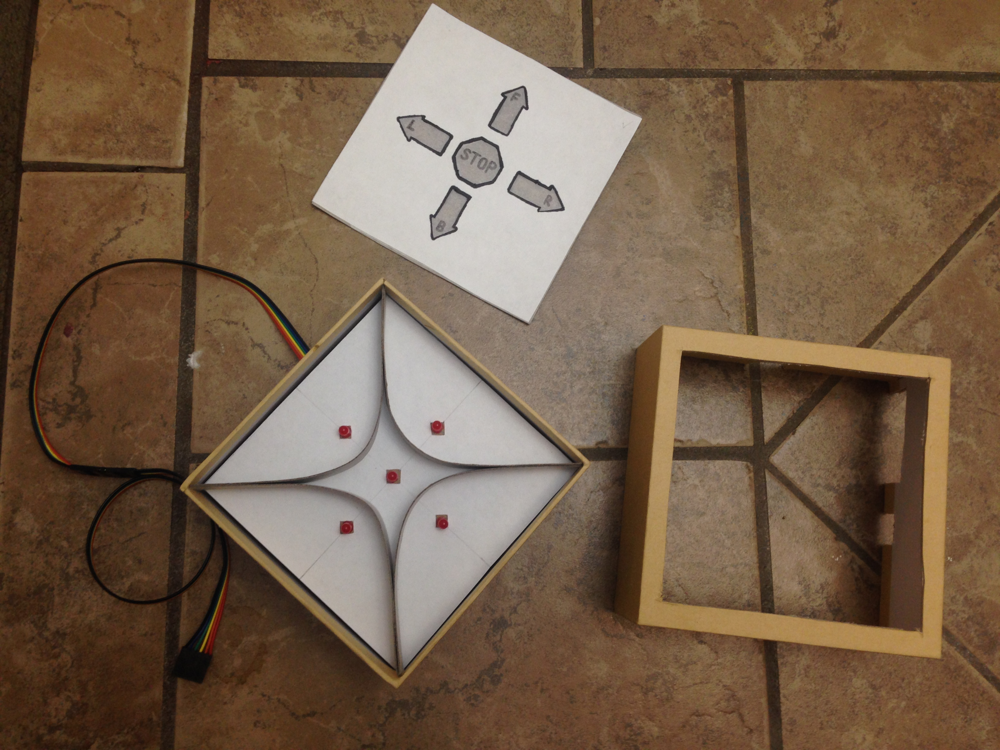
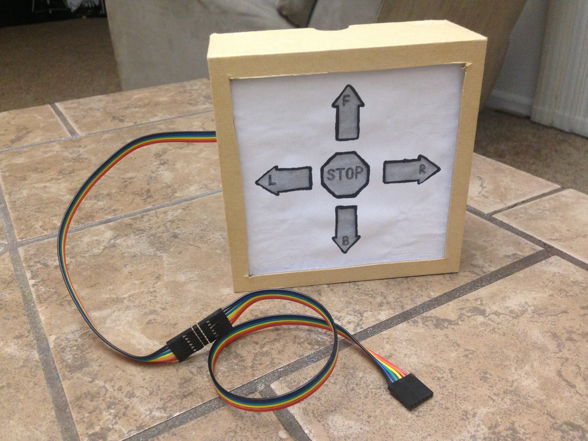

### Connecting Display Box to Google Vision AYI kit
 
- Assemble the Display Box following images and schematic diagram above
- Connect Display Box to the computer via USB cord and load sketch **/arduino/hand_gesture_display_box.ino** to Arduino UNO of Display Box
- Power Display Box with Arduino power supply
- Connect Display Box with GPIO pins of Google Vision AIY kit following this schematic:  
 
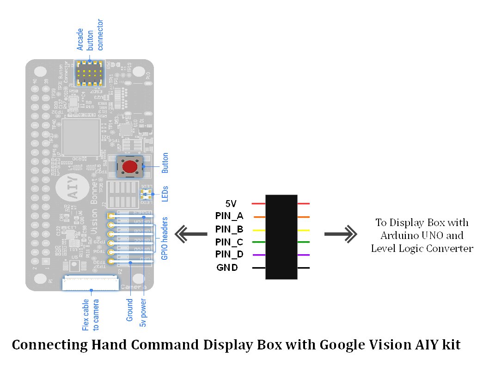

**Important:** Make sure that the red wire (+5V) is connected to the rightmost GPIO pin and the black wire (GND) - to the leftmost GPIO pin of Google Vision AIY kit:

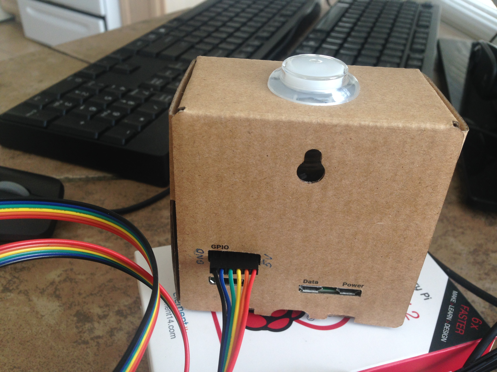
 
Once your Display Box is powered and connected to Google Vision AIY kit's GPIO pins, you can start hand gesture classifier following the steps described above. 

## Thank you!
